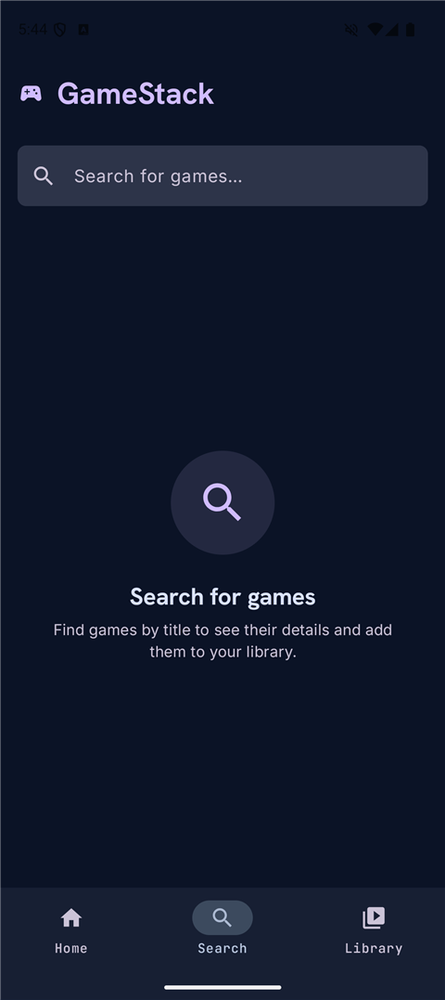
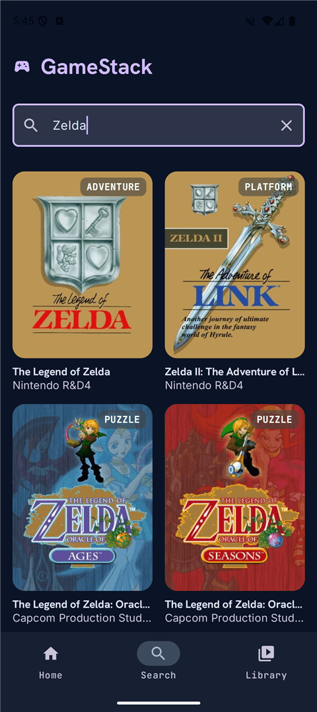
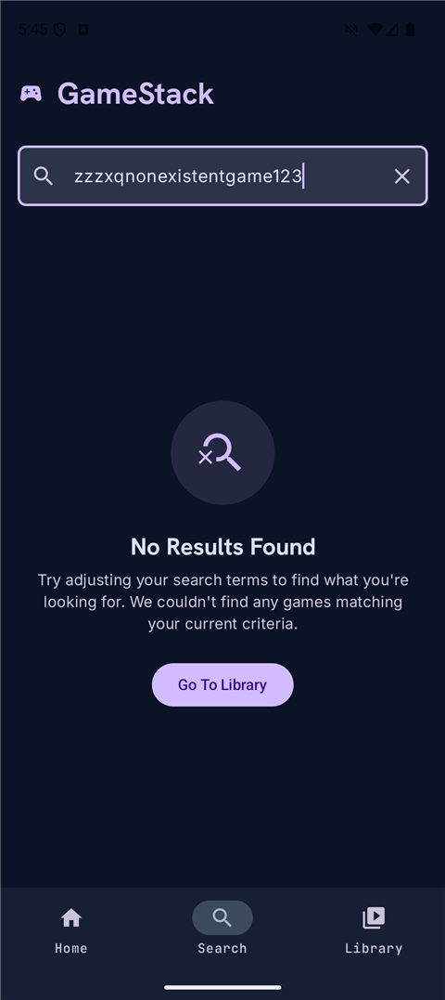
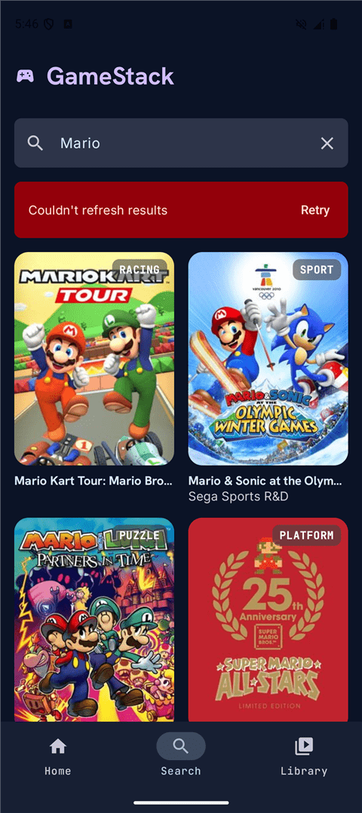

# GameStack

[](https://github.com/voltek/GameStack/actions/workflows/gate.yml)

Native Android app for exploring video games and managing a personal game
library, using the [IGDB API](https://api-docs.igdb.com/) as the data source.

Search games, view details, organize personal lists, and rate what you've
played. Not a store, not a gaming platform — a catalog and personal library app.

Full product scope lives in [`docs/project/GameStack-Spec-v1.md`](docs/project/GameStack-Spec-v1.md).
Architectural/technical rules live in [`CLAUDE.md`](CLAUDE.md).

## Tech Stack
- Kotlin + Jetpack Compose (no XML)
- MVI + Clean Architecture (UI / Domain / Data)
- Retrofit + Kotlinx.serialization
- Room — local persistence (lists, ratings)
- Hilt — dependency injection
- Coil — image loading
- Navigation Compose (Safe-type routes)
- Material3 — dark theme only for MVP
- Locked to portrait orientation for MVP

## Running the project

1. Open the project in Android Studio.
2. Get IGDB/Twitch API credentials (Client ID + Secret) from the
   [Twitch Developer Console](https://dev.twitch.tv/console/apps).
3. Add them to `local.properties` (not checked into git):
   ```properties
   IGDB_CLIENT_ID=your_client_id
   IGDB_CLIENT_SECRET=your_client_secret
   ```
4. Sync Gradle and run the `app` configuration on a device/emulator
   (min SDK 26).

```
./gradlew build   # build
./gradlew test    # unit tests
./gradlew lint    # lint
```

The same three run on GitHub Actions for every pull request and every push to
`main` — see [`.github/workflows/gate.yml`](.github/workflows/gate.yml). No API
credentials are needed there: `local.properties` is optional, the build falls
back to empty values, and nothing in the gate calls IGDB. It does still need the
network — Gradle resolves dependencies, and Robolectric fetches its own SDK jar
at test runtime.

## Current status

- ✅ Project scaffold: Hilt/Compose setup, theme, bottom nav shell
  (Home / Search / Library)
- ✅ IGDB OAuth pipeline: Twitch client-credentials auth, token caching
  and auto-refresh, request interceptor
- ✅ Search: debounced query pipeline, results/empty/error states, pull-to-refresh
  with a non-destructive refresh-error banner (stale results stay on screen),
  Compose screen tests under Robolectric
- 🚧 Game Detail, Library, ratings — not started

## Screenshots

Real captures from the emulator ([`docs/project/screenshots/`](docs/project/screenshots/)) —
not design mockups. For the approved design references instead, see
[`docs/project/design/`](docs/project/design/).

### Search

<table>
  <tr>
    <td align="center" width="25%">
      <br>
      <sub>Initial state</sub>
    </td>
    <td align="center" width="25%">
      <br>
      <sub>Results</sub>
    </td>
    <td align="center" width="25%">
      <br>
      <sub>No results</sub>
    </td>
    <td align="center" width="25%">
      <br>
      <sub>Refresh error</sub>
    </td>
  </tr>
</table>

This README is intentionally short and will grow as features land.